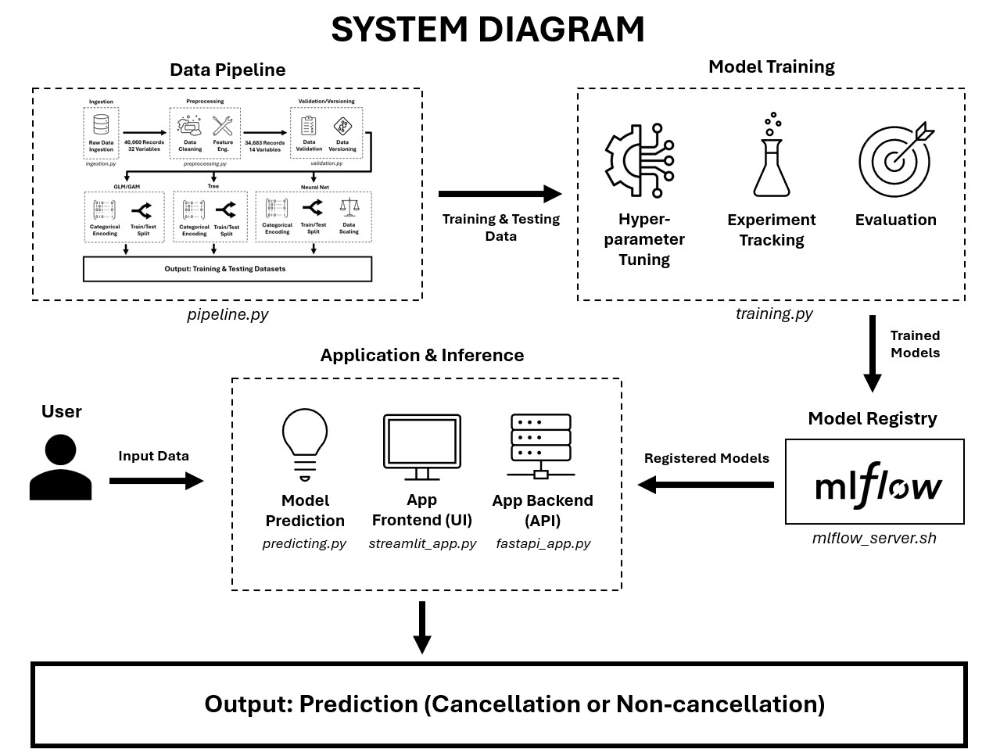
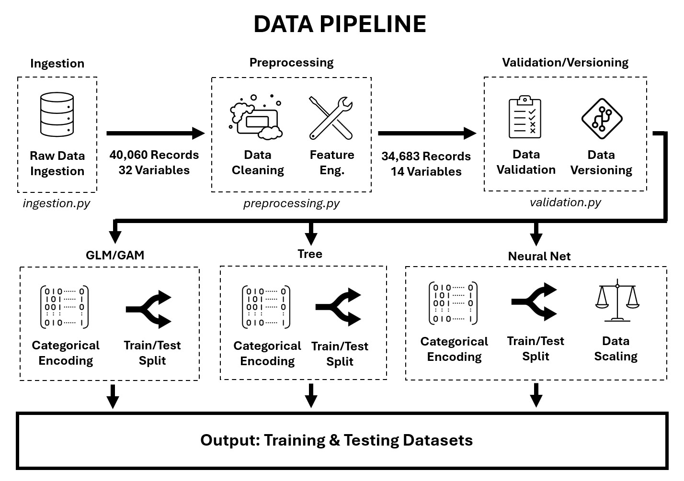

# Predicting Hotel Booking Cancellations
Final project for **BANA 7075: Machine Learning Design**
<br>**Contributors**: Aidan Calderhead, Angel Perez Vila, Giorgio Di Liegro, Vignesh Rathinavel, Zachary Biery

## About the project
Hotel cancellations are a major challenge in the hospitality industry, leading to lost revenue, inefficient staffing, and poor inventory planning. This project aims to solve that problem by predicting which reservations are likely to cancel using historical booking data from a Portuguese resort hotel, which can be found in the supplemental research article <a href="https://www.sciencedirect.com/science/article/pii/S2352340918315191?via%3Dihub">Hotel Booking Demand Datasets</a>. By leveraging machine learning, we capture complex patterns across customer types and booking behaviors that traditional forecasting methods often miss. Our system supports real-time and batch predictions and provides actionable insights for hotel managers, revenue analysts, and front desk staff, helping them optimize pricing, staffing, and service delivery. Our tool's predictive capability empowers decision-makers with reliable data to stay ahead of cancellations and streamline operations.

### Key Features
- **Flexible Model Support**: Incorporates Scikit-Learn classifiers (logistic regression & random forest) and PyTorch-based neural networks, both registered and versioned with MLflow.
- **Modular Architecture**: Clear separation of concerns across preprocessing, training, inference, deployment, and monitoring.
- **Scalable Design**: Clean project structure with unit tests and support for future model extensions (e.g., tree-based models).
- **FastAPI + Streamlit Integration**: Real-time predictions via REST API and user-friendly frontend for business users.
- **MLflow Tracking**: Automatic logging of metrics, models, parameters, and training data for reproducibility.

## About the System
### System Design
Our system is designed to be modular, scalable, and easy to maintain, with clearly separated components for each phase of the machine learning workflow. The system is organized into three core components: **Data Pipeline**, **Model Training**, and **Application & Inference**, each corresponding to a distinct stage in the ML lifecycle.

- **Data Pipeline (`pipeline.py`)** handles all tasks related to transforming data into structured training and testing sets for downstream modeling.

- **Model Training (`training.py`)** involves hyperparameter tuning, experiment tracking, and model evaluation. Trained models are automatically logged to an **MLflow registry** alongside training data, and performance metrics for version control and reproducibility.

- **Application & Inference** integrates the trained models into a complete prediction system. A **FastAPI backend (`fastapi_app.py`)** serves predictions, while a **Streamlit frontend (`streamlit_app.py`)** provides an interactive user interface. The **`predicting.py`** module handles the real-time inference logic utilized by the REST API.



### Data Pipeline
The data pipeline is designed to be **modular, interpretable, and adaptable** for multiple modeling strategies, ensuring high-quality input for training and testing through 4 modular stages.

- **Ingestion (`ingestion.py`)** pulls raw hotel reservation data into the system. This raw dataset includes various features such as booking behavior, guest type, and reservation details.

- **Preprocessing (`preprocessing.py`)** applies structured data cleaning and feature engineering.

- **Validation and Versioning (`validation.py`)** ensures that the data is accurate and consistent, applying validation checks to preserve data integrity. Validated datasets are versioned to ensure reproducibility and traceability throughout the modeling lifecycle.

- **Pipeline (`pipeline.py`)** combines the above modules and tailors the processed data to the requirements of each modeling algorithm:
  - **GLM/GAM** and **Tree-based models** undergo categorical encoding followed by a train/test split.
  - **Neural Network models** require an additional **data scaling** step after encoding and splitting.

This pipeline outputs ready-to-use training and testing datasets that are structurally optimized for each ML model type. The clear separation of responsibilities across scripts (e.g., ingestion, preprocessing, validation) contributes to the system’s **flexibility and maintainability**, allowing for seamless updates and easy expansion to new model architectures.



## Usage

### Setup

To begin working with this repository, follow these steps:

1. **Clone the Repository**

```bash
# Navigate to your preferred directory
cd your/preferred/location

# Clone the repository
git clone https://github.com/zbiery/bana-7075-final.git

# (Optional) Open the project in VSCode
code .
```

2. **(Recommended)** Create and activate a virtual environment

```bash
# Create virtual environment
python -m venv .venv

# Activate (Windows)
.venv\Scripts\activate.bat

# Activate (Mac/Linux)
source .venv/bin/activate
```

3. **Install Dependencies**

```bash
pip install -r requirements.txt
```

4. **Set Up Environment Variables**

Create a `.env` file in the project root to securely store environment-specific values such as secrets or configuration flags.

---
### Application Use 

To **start the application** & begin using it, run:

```bash
python main.py
```
This will:
- Start the FastAPI app on port 1000
- Start the Streamlit UI on port 8501
- Start the MLflow server on port 5000

You can then navigate to your web browser to begin using the Streamlit app.

Alternatively, if you already have [Docker](https://www.docker.com/) installed on your desktop, run:

```bash
docker-compose up --build
```

### Model Training

**Start the MLflow server** before training to log runs and register models:

```bash
# Windows
./mlflow_server.ps1

# Mac/Linux
./mlflow_server.sh
```

#### Example: Training Models

This repository supports training and tracking of:
- Logistic Regression (sklearn)
- Random Forest (sklearn)
- Neural Network (PyTorch)

Model training should be conducted in the ```model_training.py``` script. To do so, simply retrieve your training and testing datasets using the pipeline function, and then specify the parameters to be used in the train function(s) - everything else will be handled for you!

```python
from src.pipeline import pipeline
from src.training import train_lr_model, train_nn_model, train_rf_model

# Get the training and testing datasets from the data pipeline
# Must return a scaler object 
x_train, x_test, y_train, y_test, scaler = pipeline(model="nnet")

# Train & register a Neural Network model
train_nn_model(x_train, 
               y_train, 
               x_test, 
               y_test, 
               scaler=scaler,
               lr=0.001,
               hidden_dims=(64,32,16),
               epochs=25,
               run_name="Neural Network")

# Get the training and testing datasets from the data pipeline
# No scaler to be returned here
x_train, x_test, y_train, y_test = pipeline(model="glm")

# Train & register a Logistic Regression model
train_lr_model(x_train, 
               y_train, 
               x_test, 
               y_test,
               C=1,
               max_iter=100,
               solver='lbfgs',
               penalty='l2')
```

### Model Deployment (Updating Models for Inference)

Once you have trained and registered a new model version in MLflow, update the following block in `fastapi_app.py` by updating the uri.

```python
MODEL_REGISTRY = {
    "glm": {
        "uri": "models:/lr_champion/2",
        "type": "pyfunc",
        "requires_scaler": False,
    },
    "nnet": {
        "uri": "models:/nn_champion/2",
        "type": "pytorch",
        "requires_scaler": True,
    },
    "tree": {
        "uri": "models:/rf_champion/1",
        "type": "pyfunc",
        "requires_scaler": False
    }
}
```
Once complete, the model will be available for use in the application.

### Extending to New Models

To register a new model family (e.g., XGBoost) that exists within the current supported family types (glm, nnet, tree), you must:

1. Add a training function in `training.py` with the same structure as existing ones.
2. Add an entry in the `MODEL_REGISTRY` in `fastapi_app.py`.
3. Ensure the pipeline returns the proper data format (with or without a scaler).

The rest of the system will adapt automatically due to the modular design.

## Project Structure
```
BANA-7075-FINAL/
│
├── .dvc/                    # DVC metadata (used for data versioning)
├── .dvcignore               # DVC ignore rules
├── .env                     # Environment variables (e.g., secrets, ports)
├── .gitignore               # Git ignore rules
├── .gitattributes            
├── .dockerignore            # Docker ignore rules
├── .venv/                   # Virtual environment (excluded from Git)
├── data/                    # Data files (raw/processed)
├── docs/                    # Additional documentation
│   └── assets/              # Diagrams, figures, etc.
├── logs/                    # Logging outputs
├── reports/                 # Model monitoring reports
├── mlflow/                  # MLflow tracking files (artifacts)
│
├── src/                     # Core application logic
│   ├── monitoring.py        # Model monitoring 
│   ├── ingestion.py         # Data ingestion logic/functions
│   ├── logger.py            # Centralized logging setup
│   ├── pipeline.py          # Full end-to-end data pipeline
│   ├── predicting.py        # Prediction logic/functions
│   ├── preprocessing.py     # Preprocessing logic/functions (feature eng., cleaning, encoding, splitting)
│   ├── training.py          # Model training functions (NN, LR, RF)
│   ├── utils.py             # General-purpose utilities
│   └── validation.py        # Data validation and schema enforcement
│
├── tests/                   # Unit tests
│   ├── test_ingestion.py
│   └── test_preprocessing.py
│
├── main.py                  # Entry point for full system
├── fastapi_app.py           # FastAPI backend (API for predictions)
├── streamlit_app.py         # Streamlit frontend (UI for predictions)
├── model_training.py        # Orchestrator for training all models
├── mlflow_server.sh         # Shell script to run MLflow server
├── mlflow_server.ps1        # PowerShell script to run MLflow server
├── Dockerfile               # Docker environment
├── docker-compose.yml       # Runs application in container
├── requirements.txt         # Dependencies
└── README.md                # Project overview & usage instructions

```
